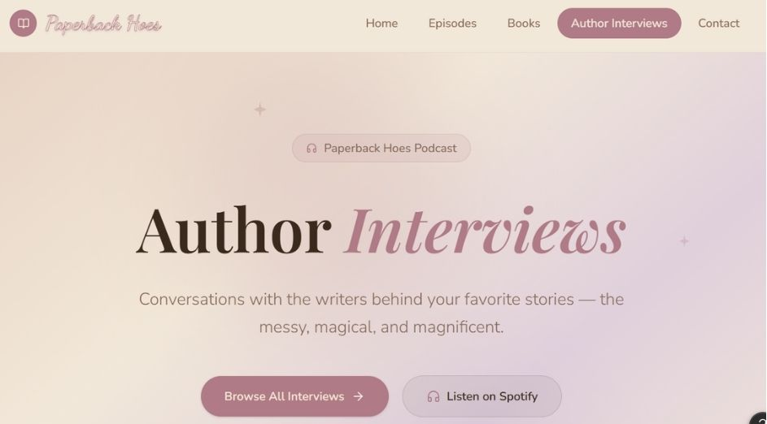
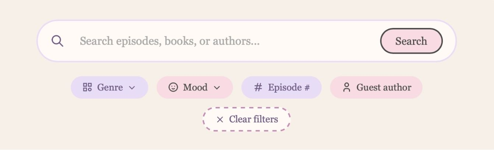
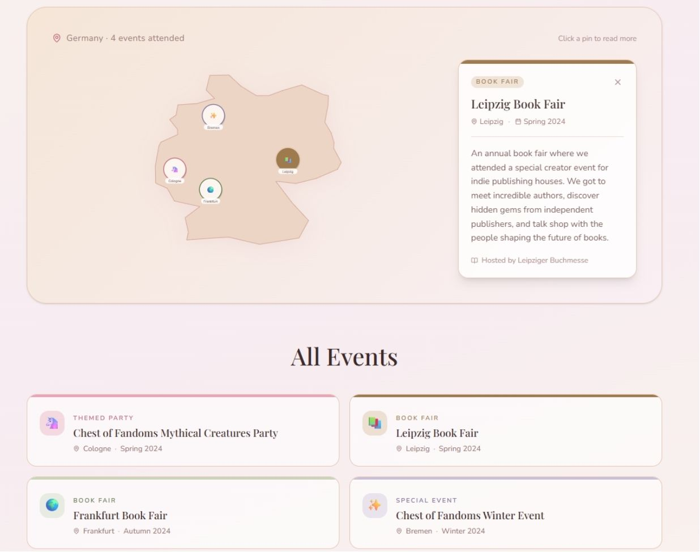

# Documentation

# Our idea: 
We are creating a website for the book podcast "Paperback Hoes". Here we will learn about the hosts Rachel & Laureen and discover recent podcast episodes. As well as exploring, it featured book recommendations and finding information about guest authors. Also contact the podcast or submit book recommendations. Ultimately creating a cozy, visually appealing hub for podcast listeners and book lovers. The initial idea came to us because we knew that the podcast would give us a solid database we could work with.  

# Process: 

## 16.04.-11.06. (Developing Our Idea)  
- At the start of the course, we decided to do a joint project  
- Ironically it was Frieda who came up with the idea to design a website for Rachel’s podcast 
- Over the course of the semester, we used the assignments to practice what our website would look like 

## (Initial Pitch) (Online) 
- Basis: From the beginning of the course, we used the assignments to work based on the final work for the website 
- We gave the first pitch of our project idea using Figma to showcase our future ideas for the website: 
  
- The homepage we showed had been created when doing our assignments 

## 09.07.  (Final Presentation)  
- We gave our final presentation for our project:  
-  Beforehand we had already created a mock-up of the book recommendation page and the episode and home page, collecting the essential components we wanted to integrate.  
- Additionally, we drafted our page ideas with Figma to visualize the ideas in our presentation: 
  
  

### Feedback: 
- rather than work on a login to our website, we should focus in improving the existing structure of the website 
- create a coherent button design  

## 14.08.  (Merging Our GitHub) 
### Frieda
- Linking my Git Hub repository didn’t work, instead I copied the existing files into a new one, where we could both work on the project. Since I had already worked on a shared project before in Tech Basics II. I knew it was important to always pull/ push inform each other when working on the project file. 

### Rachel: 
- After creating a shared workspace, it made collaborating a lot easier, though I had to get used to the system of making sure Frieda and I weren’t working on the code at the same time. Therefore, she suggested texting each other when we were working on it.  
- Created Documentation File, creating document to store updates, show progress/ challenges  

## 16.08. (Updating the Episode/ Book Recommendation Pages)  

### Frieda:
- Our episode guide was still looking empty I added more episodes and embedded the Spotify link as well via iframe 
- I also added a filter function or the idea by already giving a few of the episodes tags to ensure that users could filter properly  
- I also added a search bar for users to manually type in whatever they were looking for  
- I am thinking about also linking the books from the book page to the episodes they come from, but I am not sure yet  

### Rachel: 
- To create the episode pages, as well as the book recommendation system, we needed data on the episodes and the books they mentioned 
- For this I created an excel sheet to keep track of the books mentioned, which episode, the author, what tags we were going to assign the episodes, and the book covers for the recommendation page 
- Using this I added the books/ episodes to our Json files, and it helped keep an overview of our data 

## 18.08. (Coding the Event- / Author Page)   

### Frieda: 
- I wanted to start with the event page to do so I researched different methods: 
    leaflet.js found these two pages: https://leafletjs.com/examples/quick-start/ & https://leafletjs.com/examples/custom-icons/ 
- I decided to use a json file for the event page, since I had used this multiple times, felt  like it makes the HTML pages more structured instead of writing everything into one file  
- #### Challenge: 
    - CSS file has become way too long and that we would have to restructure
    - After implementing the map, I realized that it wasn’t exactly what I was looking for but since my initial research led me to this idea and seemed the best way I will stick with it and see how I can manually improve it so that the map with fit into our overall idea.  

### Rachel: 
- When beginning to code the author page I used our existing page structure to create different sections for the individual interviews, using them to showcase more “behind the scenes” information. This means adding an author picture, book summary, book cover and a pulldown option to not overcrowd the page. Additionally, the plan is to add buttons for the host personal thoughts on the interview/ episode.  

## 19.08.  (Meeting) (Online)  
Meeting to talk about our next steps and what ideas we want to implement, we looked at the following page for inspiration are thinking of implementing banners on all pages: https://illreadwhatshesreading.com/pages/our-podcast 

Decide to focus on finishing everything we have started by now.  At end of process decide whether more is necessary.  

### To-Do List till 28.08.  
- #### Rachel: 
    - Collect additional background data for episodes, book page 
    - Add descriptive text: main page, blog posts, author page, episodes (individual), book recommendations  
    - Design banner for main page  
    - Add episodes in json file, (description, tags) (last 20 episodes)  
    - Add books to json file (cover, tags, genre)  
    - Add events (+pictures, blog post, location) to event page 
    - Finish coding author page/ Settle on final design  
- #### Frieda: 
    - Start working on coherent layout look (aspect mentioned in feedback) 
    - Make the buttons visible as buttons  
    - Episode on home page  
    - Recent episodes headline => link to episodeBooks identical and three-dimensional  
    - Book recommendation Filter  
    - Contact Page =>message  

### Add on Ideas: 
- Book Bingo 
- Rating book page => Laureen & Rachel  
- Favorite book stores around the world  

## (Button Design/ Author Page) 
### Frieda: 
- Today I updated the buttons, so that they would all have the same style 
    - I used this website and this button: https://getcssscan.com/css-buttons-examples (Button 29)  
    - The new `.button-29` class gradually replaced the previously inconsistent button styles (e.g., on the host card, where buttons like "Goodreads Profile" had incorrectly inherited the old styling because an overly broad CSS selector—`.host-card a`—was styling all links within the card). 

### Rachel: 
- When coding the author page, I encountered a problem when working on the button design for the individual page structure of the author pages 

#### Challenge: 
- Using the json script meant adding changes to the button design, meaning for the author page there needed to be a separate file for this 
- After creating this it made the design smoother and the buttons no longer stopped working after opening them once.  

## 21.08. (Update Event Page)  
### Frieda: 
- Today, I updated the Event page and added a nicer pin for the page – i generated the image with Chat.GPT to get a pin which matches out color scheme  
- I also added css aspects to make the card look more presentable and used the blurred backgound (backdrop-filter: blur)  

## 22.08. (Add books/ episodes to json, embed Spotify episodes)  

### Rachel: 
- I added the missing episodes and embedded the Spotify links 
- Started adding missing books for episodes  

## 23.08. (Coherent Heading/ Spotify Episode Linking)  
### Frieda: 
- Today I started to update a few of the pages and gave them the same heading as the main page:   

- I will have to make the books look more 3D. 
- I am not happy with the results and I will have to work on it once again  
    - Initial result unsatisfactory—further revision needed (e.g., flat `PlaneGeometry` instead of actual box geometry, lack of proper lighting/material behavior). 
- I also moved the filter and search function into a different json file for a better overview. 

#### Challenge: 
- The filter and search function isn't showing on the book page. 
- I had initially just copied the idea from my episode.js but there is a problem somewhere  
    - I hadn't fully transferred all necessary adjustments (e.g., field names, IDs)
- Design: I felt like it was way too much overload and didn't compliment the header and its pink tone 
- Realized once again that the CSS file too much all/ break it up into smaller parts to ensure a better overview  

### Rachel: 
- We realized linking Spotify episodes wasn’t working with link, rather we had to add code 
- Update book page, episode page with additional episodes, books, new Spotify code 
- Further work on Author Page 

#### Challenge: 
- Look of Author Picture, problematic since size of image was not size I wanted it to be  
- Centre books displayed/text  

## 24.08. (HTML Error)  
### Frieda: 
- Today I finally realized why the book filter function wasn’t showing up  
- I linked two different .js in that HTML file and each .js directed to the same .json which is why the program got confused  

#### Challenges: 
- I realized that the page is way to overloaded
- I also changed the Book Tag mentions since only some of them were written with an uppercasse T 
    - Inconsistent capitalization in the book tag fields (`tags` vs. `Tags`) caused filter functions to fail for some entries, as JavaScript is case-sensitive. 
- I also updated the images => we have to be precise when naming an calling them 
    - It's the smallest problems that lead to the whole code not working 

#### Add On: 
- Collages for the event page 
- Add search bar to the book recommendation page 

## 25.08. (Data Update/ Author Page)  
### Rachel: 
- Finished adding books/ episodes to json file 
- Finished code for author page, code updated with new json script2 file, to accommodate different button design  

### Frieda: 
- I updated the final headlines of the pages so that they are all similar, also had to update the episode page – the cards all had different sizes since the text that describes them weren’t always the same length  
- Updated the episodes so that the last episode that was released was the first on the page instead of one that was older 
- I also combined the two events from Leipzig since they were both at the same day 

#### Challenge: 
- Additionally, the spotify episodes were cut of by the cards and I didn’t like the way it looked:  
    - 
    - Since these embedded episodes have a predefined size I had to update the cards so that you could see the whole interface => sadly I did this on my way to work so I couldn’t solve this problem yet  
    - Still had the problem that the change of the button had a weird layout after clicking on “Show Favorites” for the hosts  

## 26.08. (Author page, Documentation) 
### Rachel: 
- Finished adding descriptive text for Autor page  
- Updated documentation outline 

### Frieda: 
- I started to fix the problem with the spotify player once again  
- I finally found the problem:The fixed `height` value in the `<iframe>` (compact Spotify mode) didn't match the actual card width; additionally, `overflow:hidden` on the card prevented the player from being fully visible.  
- Adjusted the rotation radius of the floating books (Three.js) to reveal different perspectives and make the 3D effect (spines/pages) clearly visible. 
    - AI helped me here to ensure that I would get a promising result 
    - Attempted to adjust the book filter: Reused the filter logic developed for the episodes, but the visual result was unsatisfactory.  
    - #### Side effect: 
    Since the same CSS class (.card-grid) was used for both episodes and books, modifying this class caused the books to suddenly stop displaying altogether. 

#### Feedback: 
- I asked a friend to try out our page
    - She told me that she really liked the colour scheme of our page 
    - She was impressed by the features all pages had and just suggested to improve the book page by changing the books in the filter part of that page 

## 27.08.
### Frieda: 
- Because I had problems with the new filter interface for the books I decided to just create a new css file for the book page  
- I copied most of the aspects from the other css file which has gotten way to long and I will have to divide it anyway  
- I added the function of flipping the cards and updated the matching .js file so that the page wouldn’t look the way it did before  
    - Added a flip-card function for the books (clicking a book cover rotates the card using a CSS 3D transform, revealing the title, author, and tags on the back)—including updates to the corresponding `.js` file.
- I liked this more polished look way more  
- I also rearranged the layout of the page and got my inspiration once again from the sternberg press page  
    - I might update it for the books to actually fly in more  
    - I changed the generate button and added an arrow to signal that you can scroll down since I anticipated that you probably wouldn’t  
    - I will also have to think of a way to signal that you can click on the books and turn them to get more info  
- I also realized that Rachel had used the wrong Spotify URL because they didn’t show up on the book page when you generated a random book  
- I also updated the button logic for the Host part once again since it still didn’t work  
    - Cause: Missing id="themeBtn" or inconsistent data-name references in the button text (resulted in "Hide undefined").

### Rachel: 
- The author page was looking boring, so I decided to change the design  
- However, then I encountered the problem that would last a few days: The page simply wouldn’t format itself properly. 
- It would always intercut each other, and I couldn’t figure out what the problem was.  

#### Challenge: 
- Figure out the problem with the author page layout  

## 28.08. 
### Frieda: 
- I updated the book interface once again including the layout of floating books and the prevention of overlaps and excessive rotation angles 

## 29.08. 
### Frieda: 
- I tried adding a host rating for our book site  
- It didn’t work initially because I connected it to the wrong json file  
- It finally worked => I used the .star function  
- I also updated the Event page once again  
- While working on the different pages I realized that I hadn’t really taken the dark mode into consideration as much => I had forgotten to add the script.js to the different pages – it worked.  
- But I changed the colours since I didn’t really like the ones we had initially picked out => I am still not really happy with it  
- After showing our website to another person 
he mentioned that the host container both open when you click on “Show Favourites” - I fixed that as well 
    - Cause: display:flex on the shared container automatically stretched both host cards to the same height (align-items:stretch), making the second card appear larger despite its content remaining unchanged.   
    - Solution: Adjusted to align-items: flex-start so that each card retains its own independent height. 
- Further refinement of the episode/book cards (including uniform heading heights using `min-height` and `-webkit-line-clamp` to ensure single- and multi-line titles align flush). 

## 30.08. (Meeting) (Online)   
- Discussed final tasks left to be done to perfect design/look and functionality 
- Decided on necessary add Ons to improve user experience  

### To-Do till 06.09.2026:  
#### Shared: 
- more comments within the code (in English)  
- Figure out how to connect pages for user testing/ git hub https link

#### Frieda: 
- Update Logo to initial one 
- Make it visible that the books in the floating interface are clickable  
    - Possibly implement a matching cursor  
- Update header so that when the screen is adjusted the header moves accordingly and doesn’t just leave out some of the pages  
- Move Contact page at the end  

#### Rachel: 
- Update documentation  
- Update website texts (About Us, etc.) 
- Create banner for Home Page  
- Replace section of “The Seoul Season”, change heading from button to heading, add background 
- Change Colour Hue of Reading Mode to Dark Mode 
- add star rating 0-5, (0,5) for books mentioned on card  
- add contact with email to receive message 
- add collage for events 
- update design for author page (pins)  
- Try out if the website is suitable for the mobile version 

## 03.09.
### Frieda: 
- Tried updating the menu button  
- Still doesn’t really work 
    - 
    - 

- Realized that the smartphone interface is a problem as well:  
    - 

- Also tried changing the links in our code so that users could actually click through our github pages => hasn’t worked since   
    - Looked back at my web programming assignment pages  

### Rachel: 
- I update the filler website texts (About Us, etc.) to more personal texts  
- Additionally I finished designing the final banner for the home page, a problem was the formatting as it wouldn’t initially match all the layouts  
- Then I replaced section of “The Seoul Season”,  and changed the heading from a button to heading when it came to the recent episodes on the home page  

## 04.09.
### Frieda: 
- I wanted a custom cursor for our page and looked up a few pages but honestly they were a bit to much since our page already has many different items i didn’t want to overload it (https://www.freecodecamp.org/news/how-to-make-a-custom-mouse-cursor-with-css-and-javascript/) 
- So i asked AI to just change the color of the cursor to the colors of our page and added that  
- ##### Before Fuse.js 
    - 
- ##### After Fuse.js
    - 

## 05.09. 
### Frieda: 
- Today i started the final steps and went over the pages once again that I had done 
- I realized that the in the dark mode because I hadn’t changed the nav background to transparent the pages had a weird pink background so I changed that  
- I also added further aspects to the custom cursor  
- Then I finally created further css files since our main css had gotten way to long  
    - Some of the code parts were kept in the main body since I didn’t want the page to collapse  
- I saw that our github pages had finally updated and the initial changes i had done were correct  
- Sadly the lightwidget doesn’t seem to work so I will have to add a better placeholder
    - 

### Rachel: 
- I updated the documentation to add more sections for feedback and an explanation for the choices we made when designing the pages  
- I also changed the Dark Mode to switch between Light and Dark not just one mode. 

## 07.09. 
### Frieda: 
- I updated the book cards to flip the other way around since I was told that that direction made more sense 
- I also realized that the host picture for the host rating wasn’t correct so I changed that as well 
- I tried multiple things to overwrite the lightwidget thing so that it wouldn’t show the upgrade thing anymore but I soon realized that telling the program that as soon as there was an error it should show the placeholder made no sense 
     - The lightwidget wasn’t throwing an error just mentioning that you need to log in or have a subscription to use it 
     - I think I will just refrain from using the lightwidget idea and just add a picture of the feed since the name is linked to the instagram page already 
     - I also added the ratings from rachel to the book_recommendation.json 
- Again I used “Important!” to ensure that they would actually show 

### Rachel:
- After taking a break from the author page, I finally figured out what the problem was. This let me finish the author page design. 
- Additionally, we realized that we had been focusing on the Laptop design and not on a phone design enough. First, we tried a basic script to keep the basics covered. 
- Then I designed the collages for events and added them to finish off the event page

## 11.09.
### Frieda: 
-	I updated the home page and deleted the fourth episode since it still had the german title, and I felt like three episodes looked better than four 
-	I also updated the event close button since it didn’t match the button-29 I had chosen for the website 
-	I also added the feed picture since all of the people we had sent the page to couldn’t see the lightwidget application so I decided to just delete it 
-	I also added the new README since it was still from my web programming assignments  
### Rachel:
- I added the add star rating 0-5, (0,5) for books mentioned on card 
- As well as fix the issue we had been having with formspree when sending messages through the form on the contact page 
- This meant I could update design for author page by adding the book covers. 

## 13.09.
### Frieda: 
- Today I updated the recent episode headline since we decided that adding a button as a headline doesn’t really fit our design. 
- I also updated the show favourites section and added more space between the buttons. 

## 14.09. 
### Frieda: 
-	Today I added comments in a few files to ensure that it would be a better overview.
### Rachel: 
- I updated some issues we had with the episode lenght 

## 15.09.
### Frieda: 
- Today I changed the buttons button-29 since something had changed the size of the buttons on multiple pages 
- Furthermore, there were still episode descriptions that were to long for the layout so i just changed the css that there would be an extra free line in case there were less than 3 rows. 
- Finally, I added the first part of our documentation.

### Rachel: 
- I added the final part of our documentation to the code
- Additionally I finished writing our reflection incuding our user feedback 
- Lastly I fixed an issue we had with the Contact Page apperance 

# Conclusion 

## Division 

### Frieda: 
- Home Page 
- Episode page (setup and design cards, iframe (Spotify), search filter) 
- CSS styling 
- Book Page 
- Contact page (setup, instagram widget) 
- Event page (setup, implementation of leaflet.js, design of the cards) 
- Dark mode for each page 
- Documentation 

### Rachel: 
- Data Collection 
- Phone Set-Up 
- CSS Styling 
- Author Page (setup, implementation, design) 
- Contact Page (Submissions, E-Mail Contact) 
- Event Page (Design, individual Event Setup)
- Episode Page (Episode input)
- Home Page (Design, setup) 
- Documentation

## Feedback From User Testing 
- We conducted user testing throughout the development process to get feedback on the current state of our project.
- The feedback was helpful for identifying areas that could be improved. By testing different versions of the project and receiving feedback along the way, we were able to make adjustments and improve the user experience step by step.
- Towards the end of the project, we received very positive feedback, with users commenting that the final result looked very good and visually appealing.
- Overall, the feedback helped us evaluate our design decisions and gave us additional confirmation that the final result worked well from a user's perspective.

## Explanation of each page 
### Home Page: 
- The Home Page was designed to lead the user towards all the different features while giving a first impression.  We found it important to have an introductory text to introduce a little history of the podcast.
- Additionally, we created a banner, inspired by other book podcast websites for that cozy atmosphere but also to separate that initial impression from further features. 
- After that we added the author profiles and recent episodes to give a playful overview for the user to get to know the hosts and jump right into the episodes. 

### Episode Page:
- The episode page gathers the last 20 episodes from the podcast “Paperback Hoes”. We decided that 20 episodes would be sufficient and added a short description and new title since the data we worked with was in german. 
- Each episode has one or more tags that you can filter them and there is also a search bar for you to manually type in the episode you are looking for. 
- The interface is simple and adds the Spotify for each episode at the bottom of the card. 
- The design for the number of the episode is inspired by the filter buttons and tag buttons to ensure that there aren’t to many different designs. 

### Book Page: 
- The book page has a more interactive layout and starts with the books floating in.
- Since we used screenshots of books and each picture has different dimensions the books aren’t always the same. 
- Initially, this bothered us, but it shows that each book is different and during the user testing no one pointed it out. 
- You can click on each floating book to get more info or generate a random book in case you don’t know what you want to read. 
- The scroll hint shows that you can scroll even further and here we followed the same idea of the episode page. Just to ensure that for each user there would be a possibility to find out more about books. The random book generator and floating books is more for an overview and people who just want to get inspired and the filter and search bar below that for people who want to look for a concrete book. 
- In the book grid the hover effect and the arrow show that you can click on these books as well to get more info. Here you will find the book title, author, the tags we associate the books with and the ratings of the hosts. On the random book interface, you find these information's as well and the Spotify episode the book was mentioned in as well. The book grid was too small to add the spotify episodes as well and we felt like this would be to much. 

### Event Page: 
- The event page shows a map and pins where the hosts have been with their book podcast. 
- It summarizes the events, the date, the place and a short recap as well as a short overview in the form of a collage. 
- We decided to keep this page simple since further input defeats the whole purpose of a short overview and we didn’t really know what else would be necessary to add.

### Author Page: 
- The author page was made to add more background information to a format on the podcast “Behind the Pages”. This format was created to talk to authors about their books and have in-depth discussions. 
- Therefore, our goal for this page was to offer that same “behind the scenes” aspect as we offer in the episodes. The author profiles offer a first glimpse of more background information on them and their book. 
- In addition to this we added a feature to display “Rachels Thoughts” and “Laureen’s Thoughts.” This adds to the cozy familiar feeling we wanted the user to have. 

### Contact Page: 
- Lastly for our contact page we thought it important for the user to have a way of connecting with the hosts. Additionally, it was important that these submissions could be sorted into different categories. From Complaints to Book Recommendations. 

## Challenges: 
- One of the biggest challenges during this project was that small changes could sometimes have a much bigger effect than expected. Especially when working with JavaScript, JSON files and CSS, it was easy to change something on one page and suddenly have a problem somewhere else. 
- For example, because we reused classes and code for different pages, changing the styling or functionality for one section could also affect another one. This meant that we often had to go back and find out where exactly the problem came from instead of immediately knowing how to fix it.
- Another challenge was keeping the code organized. Our main CSS file became very long during the project, which made it harder to find specific parts and understand which styles belonged to which page. We eventually started dividing it into smaller CSS files, which made the structure easier to understand. I think this is something we would pay more attention to from the beginning in a future project.
- The mobile version was also a challenge. We mainly focused on how the website looked on a normal screen while developing it, and only later realized how many things had to be adjusted for a smartphone. To be fair we think of our website as a website that is only used on a computer due to the amount of information. 
- We also had some difficulties with external features such as the Spotify embeds and the Lightwidget. Some things did not work in the way we expected, and in the case of the Lightwidget, we eventually decided to replace it with a static picture because the actual widget required a login or subscription. This taught us that sometimes it is better to simplify a feature instead of spending too much time trying to force something to work.
- Towards the end of the project, we noticed that the dropdown menu on the contact form was using the browser’s default blue highlight color. We tried to adjust this styling, but since we only noticed the issue shortly before the deadline, we decided not to make further changes that could potentially take a long time to implement or cause new problems. Looking back, we would have preferred to identify and adjust this detail earlier in the development process. However, we considered the issue relatively minor compared to the risk of introducing last-minute changes.

## Reflection: 
- Overall, the project taught us a lot about how different parts of a website work together. At the beginning, we mostly thought about how the individual pages should look, but during the project we realized that the structure behind the pages is just as important. Working with JSON files, JavaScript functions and different CSS files made us understand much better how data and design can be connected.
- Additionally, we also think that working together was an important part of the project. Having a shared GitHub workspace made the collaboration easier, but we also had to learn how to communicate when we were working on the code. In the beginning, it was easy to accidentally work on the same files at the same time, so we started informing each other when we were making bigger changes.
- Another thing we noticed was that we became much more comfortable with trying things out and fixing problems. There were many situations where we did not immediately know how to solve something, so researching different approaches helped us understand how something could be implemented. 
- Looking back, we think we managed to create the cozy and interactive feeling we wanted for the website. The user testing also showed us that the colour scheme and the different features worked well, while still giving us useful suggestions for improvement.

## Sources 
In general we relied on the pages from our web programming class, the mentioned sources down below. 
### Script.js: 
- https://developer.mozilla.org/en-US/docs/Web/API/Document/getElementById (getElementbyID) 
- https://developer.mozilla.org/en-US/docs/Web/API/EventTarget/addEventListener (addEventListener)
- https://developer.mozilla.org/en-US/docs/Web/API/DOMTokenList/toggle (classList.toggle()) 
- https://developer.mozilla.org/en-US/docs/Web/API/Document/querySelectorAll (querySelectorAll()) 
- https://developer.mozilla.org/en-US/docs/Web/API/MouseEvent/clientX (mouse event) 

### Index: 
- https://www.w3schools.com/html/html_iframe.asp (iframe)

### Episode Page: 
- https://www.fusejs.io/
- https://developer.mozilla.org/en-US/docs/Web/API/Response (fetch response)
- https://developer.mozilla.org/en-US/docs/Web/JavaScript/Reference/Global_Objects/Set (set, add, ...)
- https://developer.mozilla.org/en-US/docs/Web/JavaScript/Reference/Global_Objects/Array/filter (filter) 
- https://developer.mozilla.org/en-US/docs/Web/JavaScript/Reference/Global_Objects/Array/map (map) 
- https://developer.mozilla.org/en-US/docs/Web/JavaScript/Reference/Global_Objects/Array/flatMap (flatMap) 
- https://www.fusejs.io/fuzzy-search.html (fuse) 
- https://developer.mozilla.org/en-US/docs/Web/API/HTMLElement/dataset (dataset)
- https://developer.mozilla.org/en-US/docs/Learn_web_development/Core/Scripting/Event_bubbling (event delegation) 
- https://developer.mozilla.org/en-US/docs/Web/API/Element/innerHTML (innerHTML)
- https://community.appfarm.io/t/update-property-object-using-coded-component/1395/5 (filterDiv.innerHTML)
### Book.js 
- https://github.com/mrdoob/three.js/ (three.js) 
- https://threejs.org/
- https://threejs.org/docs/#BoxGeometry
- https://threejs.org/docs/#Mesh
- https://threejs.org/docs/?q=Texture#TextureLoader
- https://developer.mozilla.org/en-US/docs/Web/API/CanvasRenderingContext2D/createLinearGradient 
- https://threejs.org/docs/#CanvasTexture
- https://threejs.org/docs/?q=Persp#PerspectiveCamera.getFilmHeight
- https://developer.mozilla.org/en-US/docs/Web/API/CanvasRenderingContext2D/getImageData getImageData()
- https://threejs.org/docs/#Raycaster
- https://gsap.com/docs/v3/GSAP/ (GSAP)
- https://gsap.com/docs/v3/GSAP/gsap.to()/
- https://gsap.com/docs/v3/GSAP/gsap.fromTo()/
-	https://developer.mozilla.org/en-US/docs/Web/API/Window/requestAnimationFrame requestAnimationFrame()
-	https://developer.mozilla.org/en-US/docs/Web/JavaScript/Reference/Global_Objects/Math/sin (Math sin for floating) 
### Events.js: 
-	https://leafletjs.com/examples/quick-start/
-	https://leafletjs.com/reference.html
-	https://www.openstreetmap.org/copyright?
-	https://leafletjs.com/examples/custom-icons/
### Contact.html: 
-	https://developer.mozilla.org/en-US/docs/Web/HTML/Reference/Elements/meta/name/viewport
-	https://developer.mozilla.org/en-US/docs/Web/HTML/Reference/Attributes/required
-	https://lightwidget.com/
-	https://developer.mozilla.org/en-US/docs/Web/HTML/Reference/Attributes/rel/noopener

## AI Usage: 
- While working on our project, we found the sources listed above very helpful for solving general problems. However, for more specialized issues, we sometimes used AI to support us during the development process.
- 3D floating books: Implementing the floating books on the book page was particularly challenging. Although the Three.js library provided a lot of useful information, we also used AI to help us understand and implement certain parts of the functionality, especially the floating animation and positioning of the books.
- Cursor: The cursor was AI-generated. Instead of using predefined cursor libraries, which were sometimes too complex or extensive for our needs, we used AI to create a simpler custom solution.
- Debugging and troubleshooting: When buttons, layouts, or other elements did not look or behave as intended, we sometimes pasted our code into an AI tool and asked what could be causing the problem. This was especially useful when we were unsure how to proceed after trying different approaches.
- Reusing code: We also used AI to help us understand why previously working code sometimes stopped working after being reused or adapted. This helped us identify which parts of the code needed to be changed and what we had to consider when reusing existing code. We learned that simply copy-pasting code does not always work because the surrounding structure, variables, or dependencies can be different.
- Grid Systems: On the episode page, the cards were not always aligned correctly and sometimes had different heights. There was a similar layout issue on the author page, where elements were initially displayed one after another instead of being arranged as intended. AI helped us understand possible CSS/layout issues and improve the structure.
- JavaScript: We used AI more frequently for JavaScript because some of the syntax and concepts used in the project were not fully covered or explained in class. AI helped us understand unfamiliar syntax and explain what specific parts of the code were doing, which supported our learning process.
- Merging: When we encountered problems related to the main branch, we also used AI to help identify and resolve potential issues before merging changes. This helped reduce the risk of conflicts and other problems during the merging process.
- Limitations of AI: AI solutions were often more complex than necessary and sometimes suggested approaches that did not fit our project. Therefore, we could not always rely on the suggested solution directly. In some cases, we found the actual problem ourselves after examining the code more closely. AI was mainly used as a supporting tool for understanding, debugging, and developing ideas rather than simply copying and pasting complete solutions.

## Outlook on Future Projects: 
- For future projects, we would plan the structure of the website and the code more carefully before starting to implement everything. Having a clear system for CSS classes, JavaScript files and JSON data from the beginning would prevent some of the problems we had later.
- For specific future improvements of our website ideally, the books would interact and overlap in an even more natural and realistic way. However, implementing this properly would probably be beyond our current skill level, especially considering the complexity of the 3D positioning and animations. Nevertheless, we are very proud of the result we achieved, especially considering the challenges we faced while implementing the 3D books and their animations.
- We would also start testing the website on different screen sizes much earlier. The problems we had with the smartphone version showed that a design can look good on one screen while not working at all on another. In a future project, we would therefore include mobile testing as part of the development process instead of leaving it until the end.
- Most importantly, we think next time we would start testing individual features earlier and more often. This would make it easier to notice when something stops working and would hopefully prevent several problems from building up at the same time. 
- One such issue was adapting to different user systems. For example we tested our website on a Mac with two different browser (Chrome, Firefox). However we realized towards the end that the webiste presented slighlty different on Microsoft devices. 
- Overall, we felt like this project gave us a much better understanding of the development process, especially how much testing, restructuring and small adjustments are actually part of creating a finished website.

