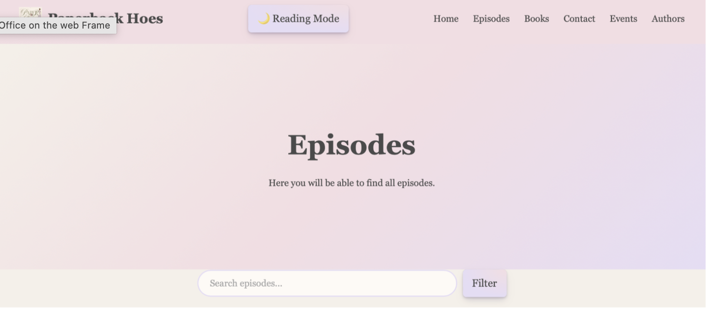

# Documentation

# Our idea: 
We are creating a website for the book podcast "Paperback Hoes". Here we will learn about the hosts Rachel & Laureen and discover recent podcast episodes. As well as exploring, it featured book recommendations and finding information about guest authors. Also contact the podcast or submit book recommendations. Ultimately creating a cozy, visually appealing hub for podcast listeners and book lovers. The initial idea came to us because we knew that the podcast would give us a solid database we could work with.  

# Process: 

## 16.04.-11.06. (Developing Our Idea)  
- At the start of the course, we decided to do a joint project  
- Ironically it was Frieda who came up with the idea to design a website for Rachel’s podcast 
- Over the course of the semester, we used the assignments to practice what our website would look like 

## (Initial Pitch) (Online) 
- Basis: From the beginning of the course, we used the assignments to work based on the final work for the website 
- We gave the first pitch of our project idea using Figma to showcase our future ideas for the website 
- The homepage we showed had been created when doing our assignments

## 09.07.  (Final Presentation)  
- We gave our final presentation for our project:  
-  Beforehand we had already created a mock-up of the book recommendation page and the episode and home page, collecting the essential components we wanted to integrate.  
- Additionally, we drafted our page ideas with Figma to visualize the ideas in our presentation.  

### Feedback: 
- rather than work on a login to our website, we should focus in improving the existing structure of the website 
- create a coherent button design  

## 14.08.  (Merging Our GitHub) 
### Frieda
- Linking my Git Hub repository didn’t work, instead I copied the existing files into a new one, where we could both work on the project. Since I had already worked on a shared project before in Tech Basics II. I knew it was important to always pull/ push inform each other when working on the project file. 

### Rachel: 
- After creating a shared workspace, it made collaborating a lot easier, though I had to get used to the system of making sure Frieda and I weren’t working on the code at the same time. Therefore, she suggested texting each other when we were working on it.  
- Created Documentation File, creating document to store updates, show progress/ challenges  

## 16.08. (Updating the Episode/ Book Recommendation Pages)  

### Frieda:
- Our episode guide was still looking empty I added more episodes and embedded the Spotify link as well via iframe 
- I also added a filter function or the idea by already giving a few of the episodes tags to ensure that users could filter properly  
- I also added a search bar for users to manually type in whatever they were looking for  
- I am thinking about also linking the books from the book page to the episodes they come from, but I am not sure yet  

### Rachel: 
- To create the episode pages, as well as the book recommendation system, we needed data on the episodes and the books they mentioned 
- For this I created an excel sheet to keep track of the books mentioned, which episode, the author, what tags we were going to assign the episodes, and the book covers for the recommendation page 
- Using this I added the books/ episodes to our Json files, and it helped keep an overview of our data 

## 18.08. (Coding the Event- / Author Page)   

### Frieda: 
- I wanted to start with the event page to do so I researched different methods: 
    leaflet.js found these two pages: https://leafletjs.com/examples/quick-start/ & https://leafletjs.com/examples/custom-icons/ 
- I decided to use a json file for the event page, since I had used this multiple times, felt  like it makes the HTML pages more structured instead of writing everything into one file  
- #### Challenge: 
    - CSS file has become way too long and that we would have to restructure
    - After implementing the map, I realized that it wasn’t exactly what I was looking for but since my initial research led me to this idea and seemed the best way I will stick with it and see how I can manually improve it so that the map with fit into our overall idea.  

### Rachel: 
- When beginning to code the author page I used our existing page structure to create different sections for the individual interviews, using them to showcase more “behind the scenes” information. This means adding an author picture, book summary, book cover and a pulldown option to not overcrowd the page. Additionally, the plan is to add buttons for the host personal thoughts on the interview/ episode.  

## 19.08.  (Meeting) (Online)  
Meeting to talk about our next steps and what ideas we want to implement, we looked at the following page for inspiration are thinking of implementing banners on all pages: https://illreadwhatshesreading.com/pages/our-podcast 

Decide to focus on finishing everything we have started by now.  At end of process decide whether more is necessary.  

### To-Do List till 28.08.  
- #### Rachel: 
    - Collect additional background data for episodes, book page 
    - Add descriptive text: main page, blog posts, author page, episodes (individual), book recommendations  
    - Design banner for main page  
    - Add episodes in json file, (description, tags) (last 20 episodes)  
    - Add books to json file (cover, tags, genre)  
    - Add events (+pictures, blog post, location) to event page 
    - Finish coding author page/ Settle on final design  
- #### Frieda: 
    - Start working on coherent layout look (aspect mentioned in feedback) 
    - Make the buttons visible as buttons  
    - Episode on home page  
    - Recent episodes headline => link to episodeBooks identical and three-dimensional  
    - Book recommendation Filter  
    - Contact Page =>message  

### Add on Ideas: 
- Book Bingo 
- Rating book page => Laureen & Rachel  
- Favorite book stores around the world  

## (Button Design/ Author Page) 
### Frieda: 
- Today I updated the buttons, so that they would all have the same style 
    - I used this website and this button: https://getcssscan.com/css-buttons-examples (Button 29)  
    - The new `.button-29` class gradually replaced the previously inconsistent button styles (e.g., on the host card, where buttons like "Goodreads Profile" had incorrectly inherited the old styling because an overly broad CSS selector—`.host-card a`—was styling all links within the card). 

### Rachel: 
- When coding the author page, I encountered a problem when working on the button design for the individual page structure of the author pages 

#### Challenge: 
- Using the json script meant adding changes to the button design, meaning for the author page there needed to be a separate file for this 
- After creating this it made the design smoother and the buttons no longer stopped working after opening them once.  

## 21.08. (Update Event Page)  
### Frieda: 
- Today, I updated the Event page and added a nicer pin for the page – i generated the image with Chat.GPT to get a pin which matches out color scheme  
- I also added css aspects to make the card look more presentable and used the blurred backgound (backdrop-filter: blur)  

## 22.08. (Add books/ episodes to json, embed Spotify episodes)  

### Rachel: 
- I added the missing episodes and embedded the Spotify links 
- Started adding missing books for episodes  

## 23.08. (Coherent Heading/ Spotify Episode Linking)  
### Frieda: 
- Today I started to update a few of the pages and gave them the same heading as the main page:   

- I will have to make the books look more 3D. 
- I am not happy with the results and I will have to work on it once again  
    - Initial result unsatisfactory—further revision needed (e.g., flat `PlaneGeometry` instead of actual box geometry, lack of proper lighting/material behavior). 
- I also moved the filter and search function into a different json file for a better overview. 

#### Challenge: 
- The filter and search function isn't showing on the book page. 
- I had initially just copied the idea from my episode.js but there is a problem somewhere  
    - I hadn't fully transferred all necessary adjustments (e.g., field names, IDs)
- Design: I felt like it was way too much overload and didn't compliment the header and its pink tone 
- Realized once again that the CSS file too much all/ break it up into smaller parts to ensure a better overview  

### Rachel: 
- We realized linking Spotify episodes wasn’t working with link, rather we had to add code 
- Update book page, episode page with additional episodes, books, new Spotify code 
- Further work on Author Page 

#### Challenge: 
- Look of Author Picture, problematic since size of image was not size I wanted it to be  
- Centre books displayed/text   
