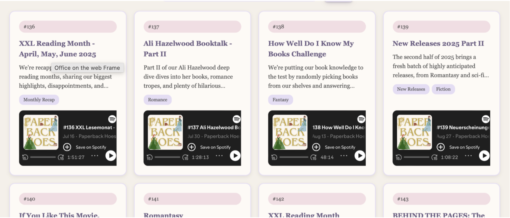
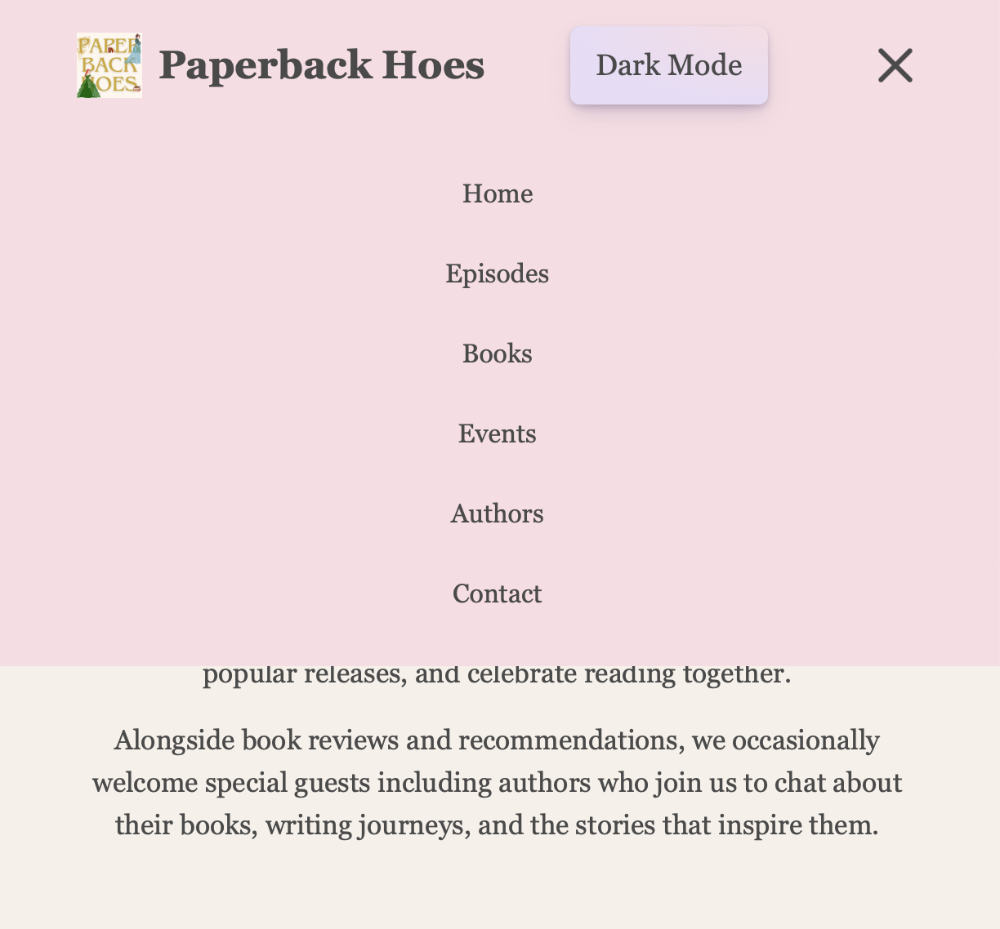
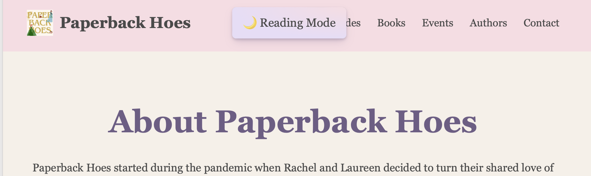
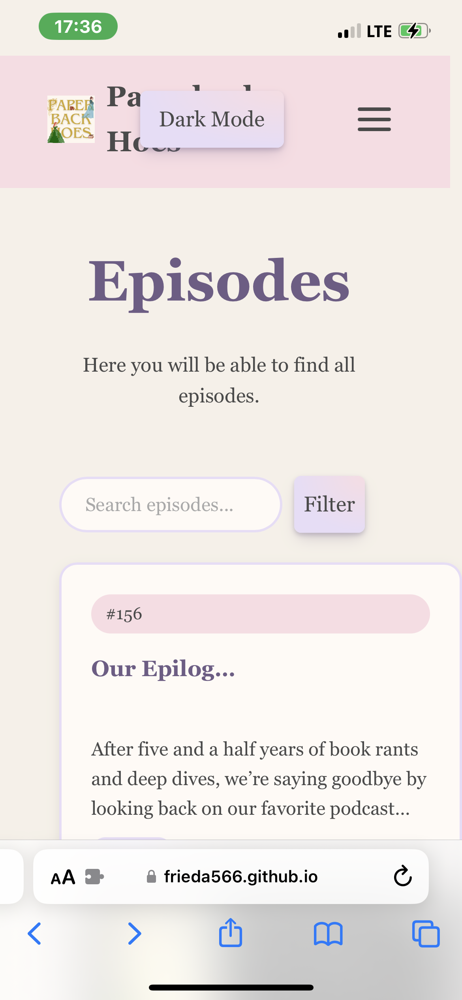
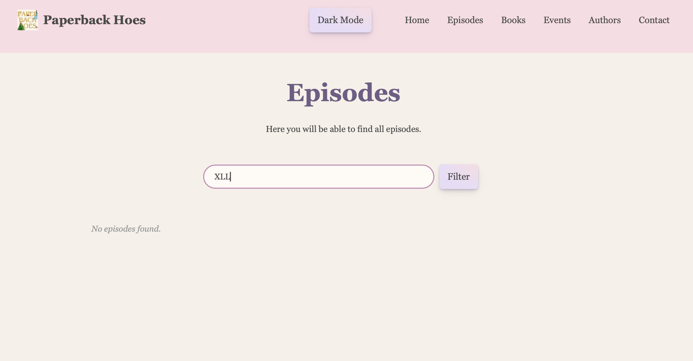
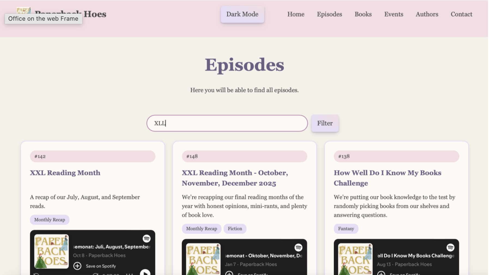
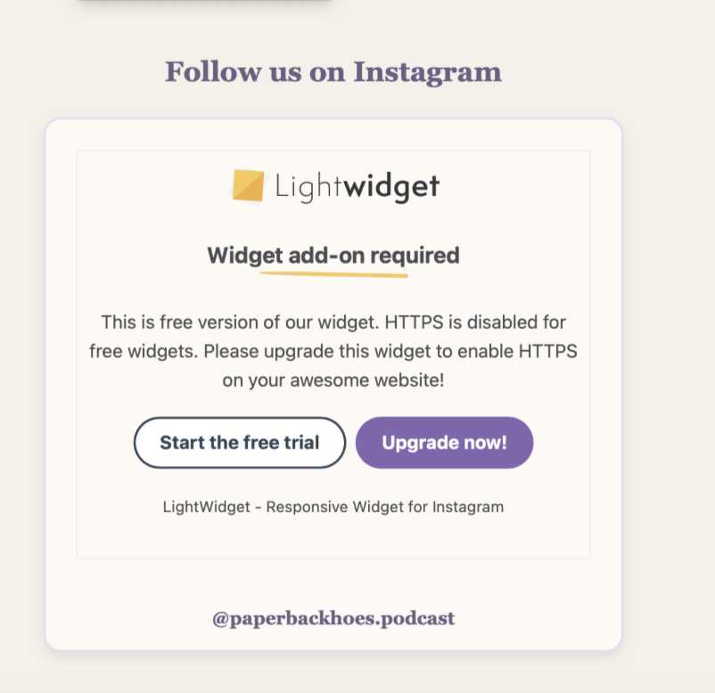

# Documentation

# Our idea: 
We are creating a website for the book podcast "Paperback Hoes". Here we will learn about the hosts Rachel & Laureen and discover recent podcast episodes. As well as exploring, it featured book recommendations and finding information about guest authors. Also contact the podcast or submit book recommendations. Ultimately creating a cozy, visually appealing hub for podcast listeners and book lovers. The initial idea came to us because we knew that the podcast would give us a solid database we could work with.  

# Process: 

## 16.04.-11.06. (Developing Our Idea)  
- At the start of the course, we decided to do a joint project  
- Ironically it was Frieda who came up with the idea to design a website for Rachel’s podcast 
- Over the course of the semester, we used the assignments to practice what our website would look like 

## (Initial Pitch) (Online) 
- Basis: From the beginning of the course, we used the assignments to work based on the final work for the website 
- We gave the first pitch of our project idea using Figma to showcase our future ideas for the website 
- The homepage we showed had been created when doing our assignments

## 09.07.  (Final Presentation)  
- We gave our final presentation for our project:  
-  Beforehand we had already created a mock-up of the book recommendation page and the episode and home page, collecting the essential components we wanted to integrate.  
- Additionally, we drafted our page ideas with Figma to visualize the ideas in our presentation.  

### Feedback: 
- rather than work on a login to our website, we should focus in improving the existing structure of the website 
- create a coherent button design  

## 14.08.  (Merging Our GitHub) 
### Frieda
- Linking my Git Hub repository didn’t work, instead I copied the existing files into a new one, where we could both work on the project. Since I had already worked on a shared project before in Tech Basics II. I knew it was important to always pull/ push inform each other when working on the project file. 

### Rachel: 
- After creating a shared workspace, it made collaborating a lot easier, though I had to get used to the system of making sure Frieda and I weren’t working on the code at the same time. Therefore, she suggested texting each other when we were working on it.  
- Created Documentation File, creating document to store updates, show progress/ challenges  

## 16.08. (Updating the Episode/ Book Recommendation Pages)  

### Frieda:
- Our episode guide was still looking empty I added more episodes and embedded the Spotify link as well via iframe 
- I also added a filter function or the idea by already giving a few of the episodes tags to ensure that users could filter properly  
- I also added a search bar for users to manually type in whatever they were looking for  
- I am thinking about also linking the books from the book page to the episodes they come from, but I am not sure yet  

### Rachel: 
- To create the episode pages, as well as the book recommendation system, we needed data on the episodes and the books they mentioned 
- For this I created an excel sheet to keep track of the books mentioned, which episode, the author, what tags we were going to assign the episodes, and the book covers for the recommendation page 
- Using this I added the books/ episodes to our Json files, and it helped keep an overview of our data 

## 18.08. (Coding the Event- / Author Page)   

### Frieda: 
- I wanted to start with the event page to do so I researched different methods: 
    leaflet.js found these two pages: https://leafletjs.com/examples/quick-start/ & https://leafletjs.com/examples/custom-icons/ 
- I decided to use a json file for the event page, since I had used this multiple times, felt  like it makes the HTML pages more structured instead of writing everything into one file  
- #### Challenge: 
    - CSS file has become way too long and that we would have to restructure
    - After implementing the map, I realized that it wasn’t exactly what I was looking for but since my initial research led me to this idea and seemed the best way I will stick with it and see how I can manually improve it so that the map with fit into our overall idea.  

### Rachel: 
- When beginning to code the author page I used our existing page structure to create different sections for the individual interviews, using them to showcase more “behind the scenes” information. This means adding an author picture, book summary, book cover and a pulldown option to not overcrowd the page. Additionally, the plan is to add buttons for the host personal thoughts on the interview/ episode.  

## 19.08.  (Meeting) (Online)  
Meeting to talk about our next steps and what ideas we want to implement, we looked at the following page for inspiration are thinking of implementing banners on all pages: https://illreadwhatshesreading.com/pages/our-podcast 

Decide to focus on finishing everything we have started by now.  At end of process decide whether more is necessary.  

### To-Do List till 28.08.  
- #### Rachel: 
    - Collect additional background data for episodes, book page 
    - Add descriptive text: main page, blog posts, author page, episodes (individual), book recommendations  
    - Design banner for main page  
    - Add episodes in json file, (description, tags) (last 20 episodes)  
    - Add books to json file (cover, tags, genre)  
    - Add events (+pictures, blog post, location) to event page 
    - Finish coding author page/ Settle on final design  
- #### Frieda: 
    - Start working on coherent layout look (aspect mentioned in feedback) 
    - Make the buttons visible as buttons  
    - Episode on home page  
    - Recent episodes headline => link to episodeBooks identical and three-dimensional  
    - Book recommendation Filter  
    - Contact Page =>message  

### Add on Ideas: 
- Book Bingo 
- Rating book page => Laureen & Rachel  
- Favorite book stores around the world  

## (Button Design/ Author Page) 
### Frieda: 
- Today I updated the buttons, so that they would all have the same style 
    - I used this website and this button: https://getcssscan.com/css-buttons-examples (Button 29)  
    - The new `.button-29` class gradually replaced the previously inconsistent button styles (e.g., on the host card, where buttons like "Goodreads Profile" had incorrectly inherited the old styling because an overly broad CSS selector—`.host-card a`—was styling all links within the card). 

### Rachel: 
- When coding the author page, I encountered a problem when working on the button design for the individual page structure of the author pages 

#### Challenge: 
- Using the json script meant adding changes to the button design, meaning for the author page there needed to be a separate file for this 
- After creating this it made the design smoother and the buttons no longer stopped working after opening them once.  

## 21.08. (Update Event Page)  
### Frieda: 
- Today, I updated the Event page and added a nicer pin for the page – i generated the image with Chat.GPT to get a pin which matches out color scheme  
- I also added css aspects to make the card look more presentable and used the blurred backgound (backdrop-filter: blur)  

## 22.08. (Add books/ episodes to json, embed Spotify episodes)  

### Rachel: 
- I added the missing episodes and embedded the Spotify links 
- Started adding missing books for episodes  

## 23.08. (Coherent Heading/ Spotify Episode Linking)  
### Frieda: 
- Today I started to update a few of the pages and gave them the same heading as the main page:   

- I will have to make the books look more 3D. 
- I am not happy with the results and I will have to work on it once again  
    - Initial result unsatisfactory—further revision needed (e.g., flat `PlaneGeometry` instead of actual box geometry, lack of proper lighting/material behavior). 
- I also moved the filter and search function into a different json file for a better overview. 

#### Challenge: 
- The filter and search function isn't showing on the book page. 
- I had initially just copied the idea from my episode.js but there is a problem somewhere  
    - I hadn't fully transferred all necessary adjustments (e.g., field names, IDs)
- Design: I felt like it was way too much overload and didn't compliment the header and its pink tone 
- Realized once again that the CSS file too much all/ break it up into smaller parts to ensure a better overview  

### Rachel: 
- We realized linking Spotify episodes wasn’t working with link, rather we had to add code 
- Update book page, episode page with additional episodes, books, new Spotify code 
- Further work on Author Page 

#### Challenge: 
- Look of Author Picture, problematic since size of image was not size I wanted it to be  
- Centre books displayed/text  

## 24.08. (HTML Error)  
### Frieda: 
- Today I finally realized why the book filter function wasn’t showing up  
- I linked two different .js in that HTML file and each .js directed to the same .json which is why the program got confused  

#### Challenges: 
- I realized that the page is way to overloaded
- I also changed the Book Tag mentions since only some of them were written with an uppercasse T 
    - Inconsistent capitalization in the book tag fields (`tags` vs. `Tags`) caused filter functions to fail for some entries, as JavaScript is case-sensitive. 
- I also updated the images => we have to be precise when naming an calling them 
    - It's the smallest problems that lead to the whole code not working 

#### Add On: 
- Collages for the event page 
- Add search bar to the book recommendation page 

## 25.08. (Data Update/ Author Page)  
### Rachel: 
- Finished adding books/ episodes to json file 
- Finished code for author page, code updated with new json script2 file, to accommodate different button design  

### Frieda: 
- I updated the final headlines of the pages so that they are all similar, also had to update the episode page – the cards all had different sizes since the text that describes them weren’t always the same length  
- Updated the episodes so that the last episode that was released was the first on the page instead of one that was older 
- I also combined the two events from Leipzig since they were both at the same day 

#### Challenge: 
- Additionally, the spotify episodes were cut of by the cards and I didn’t like the way it looked:  
    - 
    - Since these embedded episodes have a predefined size I had to update the cards so that you could see the whole interface => sadly I did this on my way to work so I couldn’t solve this problem yet  
    - Still had the problem that the change of the button had a weird layout after clicking on “Show Favorites” for the hosts  

## 26.08. (Author page, Documentation) 
### Rachel: 
- Finished adding descriptive text for Autor page  
- Updated documentation outline 

### Frieda: 
- I started to fix the problem with the spotify player once again  
- I finally found the problem:The fixed `height` value in the `<iframe>` (compact Spotify mode) didn't match the actual card width; additionally, `overflow:hidden` on the card prevented the player from being fully visible.  
- Adjusted the rotation radius of the floating books (Three.js) to reveal different perspectives and make the 3D effect (spines/pages) clearly visible. 
    - AI helped me here to ensure that I would get a promising result 
    - Attempted to adjust the book filter: Reused the filter logic developed for the episodes, but the visual result was unsatisfactory.  
    - #### Side effect: 
    Since the same CSS class (.card-grid) was used for both episodes and books, modifying this class caused the books to suddenly stop displaying altogether. 

#### Feedback: 
- I asked a friend to try out our page
    - She told me that she really liked the colour scheme of our page 
    - She was impressed by the features all pages had and just suggested to improve the book page by changing the books in the filter part of that page 

## 27.08.
### Frieda: 
- Because I had problems with the new filter interface for the books I decided to just create a new css file for the book page  
- I copied most of the aspects from the other css file which has gotten way to long and I will have to divide it anyway  
- I added the function of flipping the cards and updated the matching .js file so that the page wouldn’t look the way it did before  
    - Added a flip-card function for the books (clicking a book cover rotates the card using a CSS 3D transform, revealing the title, author, and tags on the back)—including updates to the corresponding `.js` file.
- I liked this more polished look way more  
- I also rearranged the layout of the page and got my inspiration once again from the sternberg press page  
    - I might update it for the books to actually fly in more  
    - I changed the generate button and added an arrow to signal that you can scroll down since I anticipated that you probably wouldn’t  
    - I will also have to think of a way to signal that you can click on the books and turn them to get more info  
- I also realized that Rachel had used the wrong Spotify URL because they didn’t show up on the book page when you generated a random book  
- I also updated the button logic for the Host part once again since it still didn’t work  
    - Cause: Missing id="themeBtn" or inconsistent data-name references in the button text (resulted in "Hide undefined").

### Rachel: 
- The author page was looking boring, so I decided to change the design  
- However, then I encountered the problem that would last a few days: The page simply wouldn’t format itself properly. 
- It would always intercut each other, and I couldn’t figure out what the problem was.  

#### Challenge: 
- Figure out the problem with the author page layout  

## 28.08. 
### Frieda: 
- I updated the book interface once again including the layout of floating books and the prevention of overlaps and excessive rotation angles 

## 29.08. 
### Frieda: 
- I tried adding a host rating for our book site  
- It didn’t work initially because I connected it to the wrong json file  
- It finally worked => I used the .star function  
- I also updated the Event page once again  
- While working on the different pages I realized that I hadn’t really taken the dark mode into consideration as much => I had forgotten to add the script.js to the different pages – it worked.  
- But I changed the colours since I didn’t really like the ones we had initially picked out => I am still not really happy with it  
- After showing our website to another person 
he mentioned that the host container both open when you click on “Show Favourites” - I fixed that as well 
    - Cause: display:flex on the shared container automatically stretched both host cards to the same height (align-items:stretch), making the second card appear larger despite its content remaining unchanged.   
    - Solution: Adjusted to align-items: flex-start so that each card retains its own independent height. 
- Further refinement of the episode/book cards (including uniform heading heights using `min-height` and `-webkit-line-clamp` to ensure single- and multi-line titles align flush). 

## 30.08. (Meeting) (Online)   
- Discussed final tasks left to be done to perfect design/look and functionality 
- Decided on necessary add Ons to improve user experience  

### To-Do till 06.09.2026:  
#### Shared: 
- more comments within the code (in English)  
- Figure out how to connect pages for user testing/ git hub https link

#### Frieda: 
- Update Logo to initial one 
- Make it visible that the books in the floating interface are clickable  
    - Possibly implement a matching cursor  
- Update header so that when the screen is adjusted the header moves accordingly and doesn’t just leave out some of the pages  
- Move Contact page at the end  

#### Rachel: 
- Update documentation  
- Update website texts (About Us, etc.) 
- Create banner for Home Page  
- Replace section of “The Seoul Season”, change heading from button to heading, add background 
- Change Colour Hue of Reading Mode to Dark Mode 
- add star rating 0-5, (0,5) for books mentioned on card  
- add contact with email to receive message 
- add collage for events 
- update design for author page (pins)  
- Try out if the website is suitable for the mobile version 

## 03.09.
### Frieda: 
- Tried updating the menu button  
- Still doesn’t really work 
    - 
    - 

- Realized that the smartphone interface is a problem as well:  
    - 

- Also tried changing the links in our code so that users could actually click through our github pages => hasn’t worked since   
    - Looked back at my web programming assignment pages  

### Rachel: 
- I update the filler website texts (About Us, etc.) to more personal texts  
- Additionally I finished designing the final banner for the home page, a problem was the formatting as it wouldn’t initially match all the layouts  
- Then I replaced section of “The Seoul Season”,  and changed the heading from a button to heading when it came to the recent episodes on the home page  

## 04.09.
### Frieda: 
- I wanted a custom cursor for our page and looked up a few pages but honestly they were a bit to much since our page already has many different items i didn’t want to overload it (https://www.freecodecamp.org/news/how-to-make-a-custom-mouse-cursor-with-css-and-javascript/) 
- So i asked AI to just change the color of the cursor to the colors of our page and added that  
- ##### Before Fuse.js 
    - 
- ##### After Fuse.js
    - 

## 05.09. 
### Frieda: 
- Today i started the final steps and went over the pages once again that I had done 
- I realized that the in the dark mode because I hadn’t changed the nav background to transparent the pages had a weird pink background so I changed that  
- I also added further aspects to the custom cursor  
- Then I finally created further css files since our main css had gotten way to long  
    - Some of the code parts were kept in the main body since I didn’t want the page to collapse  
- I saw that our github pages had finally updated and the initial changes i had done were correct  
- Sadly the lightwidget doesn’t seem to work so I will have to add a better placeholder
    - 

### Rachel: 
- I updated the documentation to add more sections for feedback and an explanation for the choices we made when designing the pages  
- I also changed the Dark Mode to switch between Light and Dark not just one mode. 

